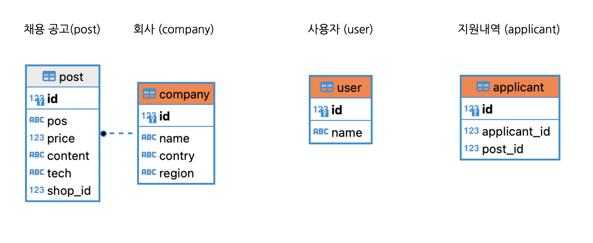

# 채용 공고 등록 및 지원 시스템
> 원티드 프리온보딩 백엔드 코스 사전과제 입니다.


<br />

회사에서는 채용 공고의 등록, 수정, 삭제가 가능합니다.

지원자는 모든 채용 공고를 불러오거나,

'Python', '백엔드' 등 특정 키워드로 검색할 수 있습니다. 

그 중 관심 있는 채용 공고는 상세 내용 & 동일 회사의 다른 공고 리스트를 확인할 수 있습니다.

하나의 채용 공고에 대해 한 번만 지원할 수 있습니다.

<br />
<br />

# 요구사항 분석
과제 원문 : [백엔드 코스 - 4차 선발과제 내용](https://bow-hair-db3.notion.site/4-82b986ae35454252a3a950f54e57af9b)

### 1. 채용 공고 등록
<br />
등록을 위해 필요한 데이터는 '회사 ID', '채용 포지션', '채용 보상금', '채용 내용', '사용 기술'이며 고유 ID는 자동 생성됨.

<br />

### 2. 채용 공고 수정
<br />
회사 ID를 제외한 모든 데이터는 수정 가능 해야 함. 채용 공고 ID와 변경하고자 하는 데이터만을 가져오는 것이 아닌, ***모든 필드***를 Body로 받아오는 시나리오를 가정함. 만약 존재하지 않을 경우, 안내 메시지를 보냄.

<br />

### 3. 채용 공고 삭제
<br />
채용 공고 ID로 테이블의 해당 컬럼을 삭제함. 만약 존재하지 않을 경우, 안내 메시지를 보냄.

<br />

### 4. 채용 공고 목록
<br />
'채용 내용'을 제외한 채용 공고 데이터를 모두 출력함. 추가로 검색 기능을 추가 해야 하는데, 회사 정보 및 채용 공고 정보 모두에 대해 검색 가능해야 함.

<br />

### 5. 채용 공고 상세 페이지
<br />
'채용 내용'과 '동일 회사 다른 채용 공고 ID들'이 추가적으로 필요함. 

<br />

### 6. 채용 공고 지원
<br />
'한 채용 공고에 한 번만 지원 가능하다'는 조건을 구현하기 위해서는 사용자 테이블, 그리고 지원 내역을 저장할 테이블이 모두 필요함. 


<br />
<br />

# 테스트 방법

실행:

```sh
yarn
npm run debug
```

<br />

swagger:
[http://localhost:9000/docs](http://localhost:9000/docs)

<br />
<br />


# 사용 예제

## 1. 회사
### 1.1 등록 (POST)
Request URL : `http://localhost:9000/company/add`

Request Body Example : 
``` javascript
{
  "name":"가시",
  "contry":"한국",
  "region":"서울"
}
```

Resonse Example(등록된 회사 목록) : 
``` javascript
[
    {
        "id": 1,
        "name": "가시",
        "contry": "한국",
        "region": "서울"
    },
    ...
]
```

<br />

### 1.2 목록 보기 (GET)
Request URL : `http://localhost:9000/company/all`

Resonse Example : 
``` javascript
[
  {
    "id": 1,
    "name": "가시",
    "contry": "한국",
    "region": "서울"
  },
  ...
]
```

<br />
<br />

## 2. 채용 공고
### 2.1 등록 (POST)
Request URL : `http://localhost:9000/post/add`

Request Body Example:
``` javascript
{
  "name":"너랑나",
  "contry":"태국",
  "region":"방콕"
}
```

Response Example :
``` javascript
{
  "identifiers": [
    {
      "id": 5
    }
  ],
  "generatedMaps": [
    {
      "id": 5
    }
  ],
  "raw": [
    {
      "id": 5
    }
  ]
}`
```


<br />

### 2.2 목록 보기 (GET)
Request URL : `http://localhost:9000/post/all`

Resonse Example : 
```javascript
[
  {
    "id": 7,
    "shop_name": "원티드",
    "contry": "한국",
    "region": "서울",
    "pos": "백엔드",
    "price": 500,
    "tech": "Nest.js"
  },
  ...
]
```

<br />

### 2.3 검색 (GET)
Request URL : `http://localhost:9000/post?search={search}`

Resonse Example(search : '백엔드') : 
``` javascript
[
  {
    "id": 11,
    "shop_name": "원티드",
    "contry": "한국",
    "region": "서울",
    "pos": "백엔드",
    "price": 2020,
    "tech": "Python"
  },
  {
    "id": 7,
    "shop_name": "원티드",
    "contry": "한국",
    "region": "서울",
    "pos": "백엔드",
    "price": 500,
    "tech": "Nest.js"
  },
  ...
]
```

<br />

### 2.4 채용 공고 상세 (GET)
Request URL : `http://localhost:9000/post/{post_id}`

Resonse Example : 
``` javascript
{
  "id": 7,
  "shop_name": "원티드",
  "contry": "한국",
  "region": "서울",
  "pos": "백엔드",
  "price": 500,
  "tech": "Nest.js",
  "content": "내용입니다.",
  "others": [
    7,
    11
  ]
}
```

<br />

### 2.4 수정 및 삭제 (PUT, DELETE)
Request URL : `http://localhost:9000/post/{post_id}`

[수정] Request Body Example : 
``` javascript
{
  "pos":"DevOps",
  "price":0,
  "content":"수정된 내용입니다.",
  "tech":"Scala"
}
```

[수정] Resonse Example : `수정되었습니다. | 존재하지 않는 공고입니다.`

[삭제] Resonse Example : `삭제되었습니다. | 존재하지 않는 공고입니다.`

<br />
<br />

## 3. 사용자
### 3.1 지원 (POST)
Request URL : `http://localhost:9000/user/apply`

Request Body Example : 
``` javascript
{"id":1,"post_id":"4"}
```
Resonse Example : `지원되었습니다. | 이미 지원한 공고입니다.`

<br />
<br />

# 구현 과정
## 환경 세팅
프로젝트 생성:
``` zsh
nest new recruit-server
```
<br />

tsconfig.json에 다음 라인 추가:
``` json
"strictPropertyInitialization": false
```
(no initializer ... error 발생 방지)

<br />

모듈 설치:
``` zsh
npm install @nestjs/typeorm typeorm pg
npm install ts-node -g
npm install --save @nestjs/swagger swagger-ui-express
```

<br />

데이터베이스 생성(S3): postgreSQL

<br />

postgres 연결 및 테이블(company, post) 생성 :
<br />



<br />

모델링 주요 이슈

1. ***동일 회사 다른 채용 공고*** : 필드를 따로 만들 필요 없이, 상세 채용 공고 API 호출 시 즉석으로 service 에서 찾아 DTO 구성 후 response

2. ***채용 공고와 회사의 관계*** : post에 company 정보를 하나하나의 필드로 넣는 것은 논리적으로 맞지 않으므로, ORM의 OneToMany 관계를 이용하여 관계 생성

3. ***지원 내역*** : user와 applicant의 관계를 생성할지 고민했으나 현 시점에서 '사람'과 '지원 목록' 중 어디에 초점을 맞출지 불분명한 상황이므로 하지 않음 (사용자 별 지원 공고 목록, 또는 어떤 공고의 지원자 목록 등)

<br />

폴더 구조

company, post, user 폴더를 나누고 DTO 및 Entity를 작성하여 테이블 생성

각각에 controller, service, dto, entity 가 존재하며, 

각각의 이름으로 module을 묶은 후 app.module에서 이들을 통합

<br />

## API 구현
service 생성 :

요구 사항 분석에 있는 API의 실제 동작을 위해, DB에 접근하여 필요한 CRUD 작업을 구현함. 

주요 이슈
<br />

1. ***async 필수*** : 동작을 수행한 뒤 응답을 보내야 함.
2. ***다중 조건*** : 검색 기능 구현 시, 한 번에 여러 조건을 만족하는 컬럼이 아니라 '회사 이름 || 회사 지역 || ...'과 같이 한 필드라도 만족하는 컬럼을 찾아야 함. 

<br />

controller 생성 :

생성한 service를 각각의 API와 연결. swagger 및 postman을 통한 테스트 완료 후 일괄적으로 comment를 덧붙임.

<br />
<br />


# 정보

나소현 – shna231@google.com

MIT 라이센스를 준수합니다.

<br />
<br />

# 기여 방법

1. (<https://github.com/yourname/yourproject/fork>)을 포크합니다.
2. (`git checkout -b feature/fooBar`) 명령어로 새 브랜치를 만드세요.
3. (`git commit -am 'Add some fooBar'`) 명령어로 커밋하세요.
4. (`git push origin feature/fooBar`) 명령어로 브랜치에 푸시하세요. 
5. 풀리퀘스트를 보내주세요.